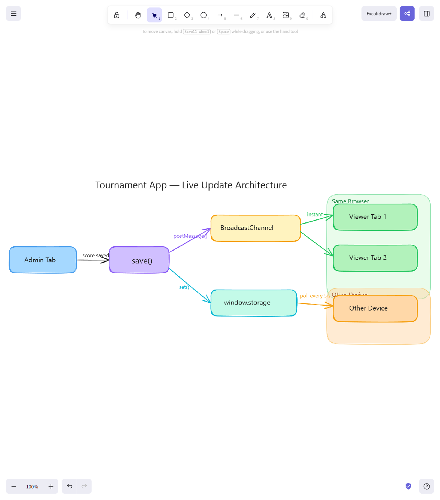

# Tournament App

A single-page React app for running round-robin football tournaments with knockout rounds. Supports multiple tournaments with full history, live score updates across tabs and devices, and a clean admin/viewer mode split.

---

## Features

- **Multi-tournament history** — create as many tournaments as you like; all are persisted and listed on the home screen
- **Round-robin group stage** — generates fixtures automatically using the circle method; 4–12 teams
- **Knockout rounds** — top 4 advance to semifinals (1v4, 2v3); winners play the final, losers play for 3rd place
- **Auto-save scores** — type the home and away score; results save automatically when you move focus away from the match card (no confirm button)
- **Live updates without reload** — viewers see score and standings changes in real time:
  - Same browser, other tabs: instant via `BroadcastChannel`
  - Other devices sharing the same storage backend: updated within 5 seconds via polling
- **Admin / Viewer mode** — toggle between admin (can enter scores, manage tournaments) and live view (read-only, auto-refreshing)
- **Persistent state** — all data survives page refresh; automatic migration from the previous storage format

---

## Tech Stack

| Concern | Choice |
|---|---|
| Framework | React 19 (hooks only) |
| Build / Dev server | Vite 7.3 + `@vitejs/plugin-react` |
| Styling | Tailwind CSS 3.4 with custom dark theme |
| Fonts | Google Fonts — DM Sans, Playfair Display |
| Persistence | `window.storage` async key-value API |
| Storage key | `rr-tournaments-v3` |

---

## Dev Setup

```bash
npm install
npm run dev      # http://localhost:5173
npm run build    # production build
npm run preview  # preview production build
```

In development, `main.jsx` mocks `window.storage` with `localStorage` so the app behaves identically to the production host environment.

---

## Application Flow

```
Group stage  →  Semifinals  →  Final + 3rd place  →  Done
```

1. **Setup** — enter 4–12 team names; the app shuffles teams and generates all fixtures
2. **Group stage** — enter results round by round; standings update instantly
3. **Semifinals** — once all group matches are played, generate semis (top 4: 1v4 and 2v3)
4. **Final** — once both semis are played, generate the final and 3rd-place match
5. **Done** — champion is crowned; tournament is archived in the list

---

## Live Updates — How It Works



> Source: [`docs/architecture.excalidraw`](docs/architecture.excalidraw) — open in [excalidraw.com](https://excalidraw.com) to edit.

When an admin saves a score, the app writes to `window.storage` and simultaneously broadcasts a notification. Viewers receive updates through two channels:

**Same browser (other tabs) — instant**
A `BroadcastChannel` named `rr-tournaments-v3` is shared across all tabs on the same origin. When the admin saves, `save()` calls `postMessage("update")` on the channel. Every viewer tab has a listener that immediately re-reads storage and refreshes the standings.

**Other devices (shared storage backend) — ≤ 5 seconds**
A `setInterval` polls storage every 5 seconds. When the incoming data differs from the current state (compared via `JSON.stringify`), React re-renders with the new scores. If nothing has changed, the poll is a no-op — no re-render.

Viewers never need to reload the page. Navigation state (`activeId`) is kept locally per tab, so each viewer stays on whatever screen they chose.

---

## Project Structure

| File/Directory | Purpose |
|---|---|
| `src/App.jsx` | Root component — uses `useTournament` hook, routes views |
| `src/components/` | UI components (MatchCard, StandingsTable, SetupView, etc.) |
| `src/hooks/useTournament.js` | All tournament state, persistence, and live update logic |
| `src/utils/` | Pure helpers: tournament logic, storage, constants |
| `src/styles/index.css` | Tailwind directives and font imports |
| `main.jsx` | Dev entry point; mounts app, provides `window.storage` mock |
| `index.html` | Minimal HTML shell for Vite |
| `vite.config.js` | Vite + React plugin config |
| `tailwind.config.js` | Tailwind CSS configuration with custom theme |
| `package.json` | Dependencies: React 19, Vite 7.3, Tailwind CSS 3.4 |
| `PLAN.md` | Living technical spec — kept in sync with the code |
| `.mcp.json` | MCP server config (Playwright) for browser-based testing |
| `.claude/skills/tournament-test/SKILL.md` | Playwright smoke-test skill |

---

## Storage & Migration

Data is persisted under the key `rr-tournaments-v3` as a JSON envelope:

```js
{
  tournaments: [{ id, createdAt, name, teams, rounds, phase, semis, thirdPlace, final, winner }],
  activeId: string | null
}
```

On first load the app checks for existing `rr-tournament-v2` data and migrates it automatically into the new format — no data is lost when upgrading.

---

## Scoring Rules

- **Group stage standings:** Points → Goal Difference → Goals For
- **Points:** Win = 3, Draw = 1, Loss = 0
- **Top 4** advance to the knockout stage

---

## Deployment

### How to Register a Subdomain (e.g. app.yourdomain.ch) on GoDaddy for Azure Static Web App

Steps to add a new subdomain like `app.yourdomain.ch` to an Azure Static Web App (using CNAME validation):

1. **In Azure Portal (start here – get the target hostname)**
   - Open your Static Web App resource → **Settings** → **Custom domains**
   - Click **+ Add** → **Custom domain on other DNS**
   - Enter the full subdomain: `app.yourdomain.ch`
   - Click **Next**
   - Azure displays the required CNAME target (looks like `random-name-123456789.x.azurestaticapps.net` – copy this exact value; it's unique to your app).
   - Keep this page open.

2. **In GoDaddy DNS (add the CNAME record)**
   - Log in to GoDaddy → Manage DNS for yourdomain.ch
   - Add a new record:
     - **Type**: CNAME
     - **Host/Name**: `app` (only the subdomain part – do **not** include .yourdomain.ch)
     - **Value/Points to**: Paste the full Azure target (e.g. `random-name-123456789.x.azurestaticapps.net`) – no http://, no trailing slash or dot unless GoDaddy requires it
     - **TTL**: 1 hour (or 300–600 seconds for quicker propagation during setup)
   - Save the changes.

3. **Finish in Azure Portal**
   - Back in the portal, click **Validate** (or **Add**).
   - Azure checks the CNAME record in public DNS → once it shows **Validated**, confirm/add the domain.
   - Status updates to **Validated** / **Custom domain**.
   - Azure automatically provisions and attaches a free DigiCert SSL certificate for the subdomain (SAN-based).
   - Propagation: usually 5–60 minutes (DNS changes + cert rollout). Check with:
     ```
     nslookup app.yourdomain.ch
     ```
     → should resolve to Azure IPs (not old hosts)
     ```
     curl -Iv https://app.yourdomain.ch
     ```
     → should succeed with a valid cert and HTTP response

4. **Things to avoid (lessons learned)**
   - Never point the subdomain to `yourdomain.ch.` (causes loops and cert mismatch errors).
   - Use the exact CNAME target shown in **your** app – it's app-specific.
   - Delete any old/conflicting records (e.g. pointing to AWS or elsewhere).
   - For apex domains (`yourdomain.ch`) or `www` → setup differs (often requires A/ALIAS records instead of plain CNAME).

Result: `https://app.yourdomain.ch` loads securely with a valid SSL cert. Azure handles automatic renewals.

*Last tested: March 2026 on a Static Web App.*

---

## Planned Features

- Penalty shootout support for drawn knockout matches
- Configurable points per win (default: 3)
- Export results as PDF or image
- Multiple groups (A / B)
- Match scheduling with time slots
